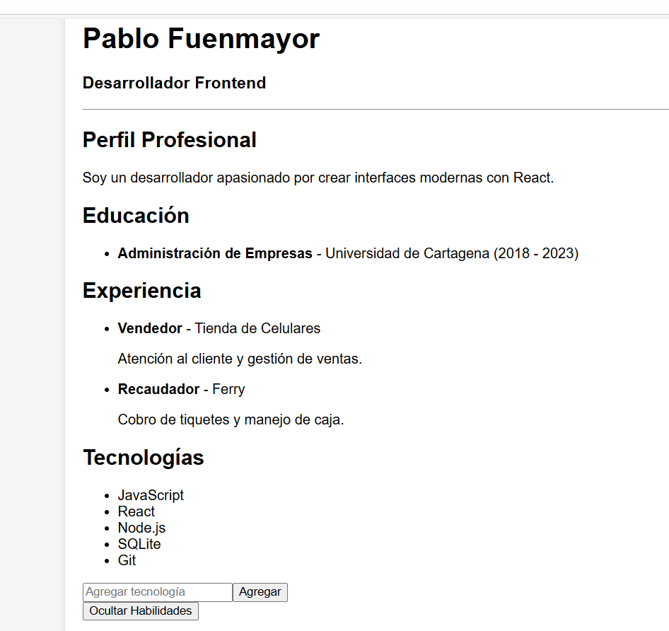

📋 Descripción de la Actividad
GA1-220501096-03-AA1-EV08 - Integración de eventos y estado local (useState) en React para el proyecto de hoja de vida (CV) previamente construido. Se implementaron dos nuevas funcionalidades interactivas que permiten al usuario controlar dinámicamente el contenido del CV.

✨ Funcionalidades Implementadas
🎯 1. Toggle de Habilidades
Componente: ToggleHabilidades.jsx

Funcionalidad: Botón interactivo para mostrar u ocultar la sección de habilidades

Tecnologías utilizadas:

useState para manejar el estado de visibilidad

Renderizado condicional

Evento onClick para la interacción del usuario

🎯 2. Formulario de Tecnologías
Componente: FormularioTecnologia.jsx

Funcionalidad: Formulario controlado para agregar nuevas tecnologías al stack

Tecnologías utilizadas:

useState para inputs controlados

Eventos onChange y onSubmit

Validación de formularios

Comunicación via props con el componente padre

🛠️ Stack Tecnológico
React 18 - Biblioteca principal

Hooks: useState para estado local

Eventos: onClick, onChange, onSubmit

Comunicación: Props entre componentes padre e hijo

Estilos: CSS3 con diseño responsive

Validación: Formularios controlados con feedback

🎓 Objetivos Cumplidos
✅ 1. Aplicar useState para almacenar y actualizar valores de forma reactiva
jsx
// Estado para tecnologías dinámicas
const [tecnologias, setTecnologias] = useState(['React', 'JavaScript', 'HTML5'])

// Estado para visibilidad de habilidades
const [mostrarHabilidades, setMostrarHabilidades] = useState(true)
✅ 2. Responder a eventos del usuario usando funciones manejadoras
jsx
// onClick para toggle
const toggleHabilidades = () => {
setMostrarHabilidades(!mostrarHabilidades)
}

// onSubmit para formularios
const manejarSubmit = (e) => {
e.preventDefault()
// Lógica de envío
}
✅ 3. Utilizar props para pasar funciones y valores entre componentes
jsx
// Padre pasa función al hijo
<FormularioTecnologia onAgregarTecnologia={agregarTecnologia} />

// Hijo ejecuta función del padre
const manejarSubmit = (e) => {
e.preventDefault()
onAgregarTecnologia(nuevaTecnologia)
}
✅ 4. Crear componentes reutilizables con lógica propia de interacción
ToggleHabilidades.jsx - Componente independiente para toggle

FormularioTecnologia.jsx - Formulario autocontenido con validación

📁 Estructura del Proyecto
text
src/
├── components/
│ ├── ToggleHabilidades.jsx # Nuevo - Toggle interactivo
│ ├── FormularioTecnologia.jsx # Nuevo - Formulario controlado
│ ├── StackTecnologias.jsx # Actualizado - Estado dinámico
│ ├── CabeceraCV.jsx
│ ├── Perfil.jsx
│ ├── Educacion.jsx
│ ├── Experiencia.jsx
│ ├── Proyectos.jsx
│ └── Habilidades.jsx
├── data/
│ └── cvData.js # Actualizado - Datos separados
├── App.jsx # Actualizado - Estado global
├── App.css # Actualizado - Nuevos estilos
└── main.jsx
🚀 Instrucciones de Ejecución
Prerrequisitos
Node.js (versión 16 o superior)

npm o yarn

Pasos para ejecutar el proyecto
Clonar el repositorio

bash
git clone https://github.com/tu-usuario/cv-react-pablo.git
cd cv-react-pablo
Instalar dependencias

bash
npm install
Ejecutar en modo desarrollo

bash
npm run dev
Abrir en el navegador

text
http://localhost:5173
Comandos Disponibles
npm run dev - Servidor de desarrollo

npm run build - Build para producción

npm run preview - Vista previa del build

📸 Capturas de Pantalla
Interfaz del CV Dinámico

Formulario de Tecnologías
Input controlado para nueva tecnología

Botón de agregar con validación

Mensajes de error en tiempo real

Actualización dinámica del stack

Toggle de Habilidades
Botón interactivo "👁️ Mostrar/Ocultar Habilidades"

Renderizado condicional de la sección

Feedback visual del estado actual

💡 Características Destacadas
🔄 Estado Reactivo
Las tecnologías se actualizan inmediatamente después de agregarlas

La visibilidad de habilidades cambia instantáneamente

Interfaz siempre sincronizada con el estado

🎨 Experiencia de Usuario
Diseño responsive que se adapta a diferentes dispositivos

Feedback visual en todas las interacciones

Validación de formularios con mensajes claros

Transiciones suaves entre estados

⚡ Performance
Componentes optimizados y reutilizables

Renderizado eficiente con keys únicas

Estado local minimalista

📊 Commits del Proyecto
El desarrollo siguió una estructura de commits semántica:

chore: Organización inicial del proyecto

feat: Componente ToggleHabilidades con renderizado condicional

feat: Implementación de useState para mostrar/ocultar habilidades

feat: Componente FormularioTecnologia con inputs controlados

feat: Función agregarTecnologia y paso como prop

feat: Renderizado dinámico de tecnologías desde estado

docs: Actualización del README con descripción de eventos y estados

🎯 Aprendizajes Adquiridos
Manejo de estado local con useState

Control de eventos en React (onClick, onChange, onSubmit)

Comunicación entre componentes padre e hijo mediante props

Renderizado condicional basado en estado

Validación de formularios controlados

Principios de Reactividad en interfaces de usuario

👨‍💻 Autor
Pablo - Desarrollador Frontend

📄 Notas de la Entrega
Este proyecto cumple con todos los requisitos especificados en la actividad GA1-220501096-03-AA1-EV08, demostrando el dominio de eventos y estado local en React a través de componentes interactivos y reutilizables.
