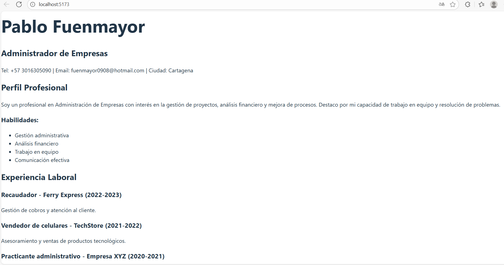

# CV React - Pablo Fuenmayor

Este proyecto es una hoja de vida (CV) modularizada en React, construida usando componentes funcionales y anidados.  
Cada sección del CV está representada por un componente independiente dentro de `src/components/`.

## Componentes

- `CabeceraCV.jsx` - Nombre, título y datos de contacto.
- `Perfil.jsx` - Descripción profesional y habilidades.
- `Experiencia.jsx` - Experiencia laboral con 4 cargos definidos.
- `Educacion.jsx` - Cursos, talleres y formación complementaria.

## Captura de pantalla



## Instrucciones para ejecutar el proyecto

1. Clonar el repositorio:

```bash
git clone https://github.com/Pablo_Fuenmayor/cv-react-pablo.git
```

2. Instalar dependencias:

```bash
cd cv-react-pablo
npm install
```

3. Iniciar servidor de desarrollo:

```bash
npm run dev
```

4. Abrir el navegador en [http://localhost:5173](http://localhost:5173)

